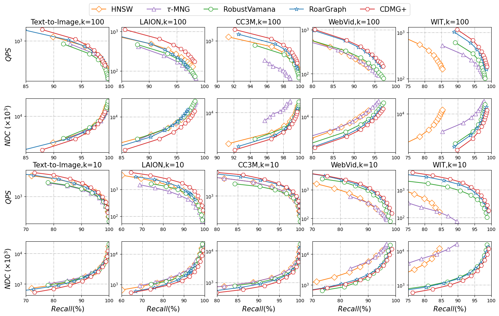

# Efficient and Robust Out-Of-Distribution Vector Similarity Search with Cross-Distribution Monotonic Graph

### Abstract

Vector similarity search is a key component in many artificial intelligence (AI) applications. While graph-based methods represent the state-of-the-art for vector similarity search, existing graph indexes often suffer from poor navigability and clusterability in Out-Of-Distribution (OOD) scenarios (e.g., database and queries are sourced from different modalities). Recent studies attempt to mitigate this issue by projecting and integrating query-derived auxiliary index structures, but these approaches remain largely heuristic and lack theoretical grounding. In this work [[link](technical_report.pdf)], we propose Cross-Distribution Monotonic Graph (CDMG), a novel graph index designed to inherently support navigability and clusterability for OOD queries. CDMG introduces a fusion strategy that bridges the distribution gap between database and query vectors, ensuring a key property—cross-distribution monotonicity—that guarantees monotonic search paths for OOD queries on graph indexes. Theoretical analysis demonstrates that CDMG achieves optimal search time complexity in OOD scenarios compared to existing graph indexes. Furthermore, we introduce CDMG+, a practical variant of CDMG that improves construction efficiency and search robustness by optimizing distance computation, query sampling, and graph structure. Extensive empirical evaluations demonstrate that our techniques outperforms state-of-the-art methods, achieving up to a 3.6$\times$ speedup at a 95% recall rate across all real-world OOD datasets.

### Baselines

* HNSW [[TPAMI'18](https://dl.acm.org/doi/abs/10.1109/TPAMI.2018.2889473)]: A well-known hierarchical graph-based method.
* $\tau$-MNG [[SIGMOD'23](https://dl.acm.org/doi/abs/10.1145/3588908)]: An optimized version of MRNG that incorporates query relaxation to enhance performance.
* RobustVamana [[arXiv'22](https://arxiv.org/abs/2211.12850)]: A specialized variant of Vamana tailored for handling OOD queries.
* RoarGraph [[VLDB'24](https://dl.acm.org/doi/abs/10.14778/3681954.3681959)]: RoarGraph is a recently proposed efficient graph index designed for OOD queries.

### Datasets

|    Dataset    | # Dimension | # Base  | # Query | Type        |
| :-----------: | ----------- | ------- | ------- | ----------- |
| Text-to-Image | 200         | 1000000 | 1000    | Image, Text |
|     LAION     | 512         | 1000000 | 1000    | Image, Text |
|      WIT      | 512         | 1000000 | 1000    | Image, Text |
|    WebVid     | 512         | 1000000 | 1000    | Video, Text |
|     CC3M      | 256         | 1000000 | 1000    | Image, Text |

### Performance



### Usage

1. Parameter settings

    ```
    ./script/config.cfg
    ```

2. Index construction

    ```
    cd script
    python cdd.py
    ./build.sh
    ```

3. Search

    ```
    ./script/search.sh
    ```

### Acknowledgements

This code builds upon the RoarGraph repo and incorporates other open-source implementations.

